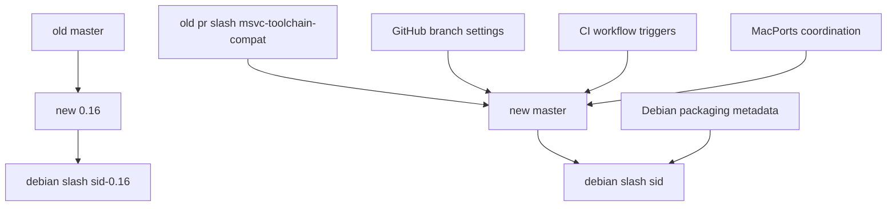

# Branch restructuring plan

## Target branch model

- `pr/msvc-toolchain-compat` becomes the new long-lived upstream `master`
- current `master` becomes the new `0.16` legacy-maintenance branch
- `debian/sid` continues as the Debian packaging branch for the new upstream line and therefore tracks the new `master`
- `debian/sid-legacy-autotools` is renamed to `debian/sid-0.16` and tracks the legacy `0.16` line

## Key findings from the repository audit

### Existing repository metadata tied to the old branch model

- `.gbp.conf` sets `upstream-branch = master` and `debian-branch = debian/sid`
- `debian/control` publishes Debian VCS metadata pointing to branch `debian/sid`
- `update_doc.sh` hardcodes `git merge master` and `git checkout master`
- `dist/macosx/macports/mk_diff.sh` hardcodes `git pull origin master` in a local MacPorts tree
- Git metadata shows local tracking configuration for `master`, `pr/msvc-toolchain-compat`, `debian/sid`, and `debian/sid-legacy-autotools`
- Git logs indicate recent merges from `master` into both Debian packaging lines and that CI was intentionally restricted to `pr/msvc-toolchain-compat`

### Packaging implications already visible

- Debian packaging now lives on `debian/sid`, not the upstream branch
- the legacy Debian packaging branch name is embedded in branch history and local Git config, so local maintainers will need branch retargeting instructions
- MacPorts content exists under `dist/macosx/macports/` and likely mirrors or feeds a downstream MacPorts repository workflow

### CI and hosting implications

- There is no checked-in `.github/workflows` directory in the current workspace snapshot, even though Git history references a GitHub Actions workflow added on `pr/msvc-toolchain-compat`
- this means workflow changes may need to be made after switching to the branch that actually contains the workflow, or recovered from the new upstream branch during implementation
- GitHub default branch, branch protections, required checks, open pull requests, and release automation will all need retargeting

## Recommended migration order

1. Freeze branch administration changes briefly to avoid concurrent pushes during the rename window
2. Ensure `pr/msvc-toolchain-compat` is the exact commit intended to become the new `master`
3. Create `0.16` from the current `master` tip before changing any default branch settings
4. Rename or recreate branches in this order:
   - make `master` point to the `pr/msvc-toolchain-compat` tip
   - preserve the old `master` history on `0.16`
   - rename `debian/sid-legacy-autotools` to `debian/sid-0.16`
   - keep `debian/sid` aligned with the new upstream `master`
5. Update GitHub default branch and branch protection rules immediately after the upstream rename
6. Update repository metadata and packaging references
7. Update CI triggers and required checks
8. Validate Debian and MacPorts workflows against the new branch topology
9. Communicate the new branch model to contributors and downstream packagers

## Actionable implementation checklist

### 1. Branch operations and safety prep

- Record current tips of `master`, `pr/msvc-toolchain-compat`, `debian/sid`, and `debian/sid-legacy-autotools`
- Create backup refs or tags before renaming any branch
- Create new branch `0.16` from the current `master`
- Move or rename `master` so it reflects the current `pr/msvc-toolchain-compat`
- Rename `debian/sid-legacy-autotools` to `debian/sid-0.16`
- Confirm `debian/sid` still contains packaging for the new CMake-based line and is based on the new upstream branch

### 2. Repository file updates

Files already identified for review or update:

- `.gbp.conf`
  - confirm whether `upstream-branch` remains `master`
  - keep or adjust `debian-branch = debian/sid`
  - add comments documenting that `0.16` is the legacy upstream branch if helpful
- `debian/control`
  - keep `Vcs-Git` and `Vcs-Browser` on `debian/sid` if that remains the packaging branch for unstable
  - verify there is no need for a separate packaging metadata variant for `debian/sid-0.16`
- `update_doc.sh`
  - replace hardcoded assumptions that the development branch being merged into `gh-pages` is the old `master`
  - likely continue to merge from `master`, but validate that this now means the CMake line intentionally
- `dist/macosx/macports/mk_diff.sh`
  - review whether pulling `origin master` is still correct once `master` changes meaning
  - if the MacPorts workflow should keep following the modern line, no semantic change may be needed, but the script should be reviewed for assumptions about release lineage
- documentation files in `README.md` and `doc/sphinx/`
  - review for any text that describes branch names, release line expectations, or packaging source locations
- any checked-in CI workflow file once visible in the active branch
  - update branch filters from `pr/msvc-toolchain-compat` to `master`
  - review whether legacy branch `0.16` needs a narrower CI policy or no CI

### 3. GitHub administration changes

- Change the default branch on GitHub to `master` after repointing it to the modern toolchain branch
- Recreate branch protection rules for:
  - `master`
  - `0.16`
  - `debian/sid`
  - `debian/sid-0.16`
- Update required status checks because old check contexts may still reference workflows that only ran on `pr/msvc-toolchain-compat`
- Review open pull requests targeting old `master`; determine whether they belong on `master` or `0.16`
- Review branch-based automation such as release drafting, Pages publishing permissions, merge queues, and CODEOWNERS enforcement if configured in GitHub settings

### 4. Debian packaging follow-up

- Confirm `debian/sid` merges from the new `master`, not from `0.16`
- Update maintainer documentation so future merges into `debian/sid` come from the new upstream line
- Create or update maintainer notes for `debian/sid-0.16` so legacy packaging work is clearly separated
- Verify git-buildpackage usage still works with:
  - upstream branch `master`
  - Debian branch `debian/sid`
  - legacy branch `0.16`
  - legacy Debian branch `debian/sid-0.16`
- Consider whether a second `.gbp.conf` note or a maintainer guide is needed to explain the dual-track packaging model

### 5. MacPorts follow-up

- Decide explicitly whether MacPorts should follow the new `master` or the legacy `0.16` line
- If MacPorts should follow the new `master`:
  - update any scripts, notes, or downstream documentation that assumed old `master` meant the autotools line
- If MacPorts should remain on the legacy line temporarily:
  - document that divergence explicitly
  - avoid ambiguous use of `master` in port maintenance scripts or release notes
- Coordinate downstream with the MacPorts ports tree if the source branch or release process changes

### 6. Validation after migration

- Verify local clones can fetch and track:
  - `master`
  - `0.16`
  - `debian/sid`
  - `debian/sid-0.16`
- Verify documentation publishing scripts still build from the intended branch
- Verify GitHub Actions run on the new `master`
- Verify Debian packaging builds from `debian/sid`
- Verify legacy packaging builds from `debian/sid-0.16` if that branch remains buildable
- Verify release notes and contributor instructions no longer refer to `pr/msvc-toolchain-compat` as the active development branch

## Risks and subtle consequences to handle explicitly

- Open pull requests against old `master` may now be targeting the wrong code line semantically
- Contributor local clones will retain stale tracking branches and `origin/HEAD` assumptions until they reconfigure
- Required GitHub checks can block merges if they still refer to workflows or branch filters tied to `pr/msvc-toolchain-compat`
- Any external automation using branch names in webhooks, scripts, or release jobs may silently stop working
- Debian maintainers may accidentally merge the wrong upstream branch unless the new dual-track policy is documented clearly
- MacPorts maintainers may assume `master` still means the old release lineage if the transition is not communicated explicitly

## Suggested communication note

Publish a short maintainer note describing the new branch semantics:

- `master` = current CMake-based primary development line
- `0.16` = legacy autotools-compatible maintenance line
- `debian/sid` = Debian unstable packaging for current `master`
- `debian/sid-0.16` = Debian packaging for legacy `0.16`

## Mermaid overview

