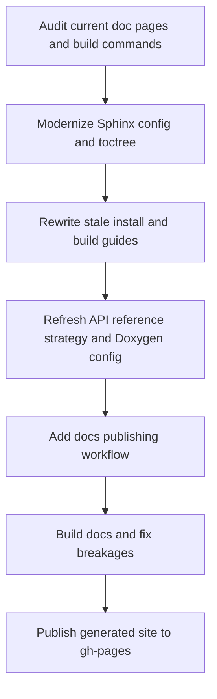

# Documentation refresh plan for current `master`

## Objective

Bring the maintained documentation sources under [`doc/`](doc/) and the published site on [`gh-pages`](gh-pages) into alignment with the current CMake-based repository state on [`master`](README.md:13).

## Findings from the audit

### Current source of truth has moved, but docs have not

- The repository now documents CMake as the supported build path in [`BUILDING.md`](BUILDING.md).
- The old Sphinx install guides still instruct users to run [`autogen.sh`](autogen.sh) and `configure`, for example in [`doc/sphinx/linux_install_guide/moduleonly.rst`](doc/sphinx/linux_install_guide/moduleonly.rst) and [`doc/sphinx/osx_install_guide/moduleonly.rst`](doc/sphinx/osx_install_guide/moduleonly.rst).
- [`autogen.sh`](autogen.sh) is explicitly deprecated in [`BUILDING.md`](BUILDING.md:3), so large parts of the existing install docs are now misleading.

### The Sphinx toolchain is also stale

- [`doc/sphinx/conf.py.in`](doc/sphinx/conf.py.in) still reflects a very old Sphinx layout and compatibility model.
- [`doc/sphinx/Makefile.sphinx`](doc/sphinx/Makefile.sphinx) is an old hand-written build wrapper and does not define a modern publish-oriented build contract.
- The repository previously shipped an external-host upload helper under [`doc/sphinx/`](doc/sphinx/) that targeted a former non-GitHub hosting setup.

### The `gh-pages` publishing flow is obsolete

- The repository previously shipped a local `gh-pages` publication helper that checked out [`gh-pages`](gh-pages), merged [`master`](README.md:13), built docs in place, copied generated HTML to the repository root, and pushed.
- That model mixes source and generated content, depends on local state, and is not appropriate for the current GitHub-hosted documentation target linked from [`README.md`](README.md:3).
- The repository already has GitHub Actions in [`ci.yml`](.github/workflows/ci.yml), so documentation publication should be automated there rather than maintained manually.

### Doxygen is highly curated and likely incomplete for the modern tree

- [`doc/Doxyfile.in`](doc/Doxyfile.in) uses a fixed `INPUT` list rather than a maintainable current-tree scope.
- It still assumes older layout names such as `../src/stimfit/gui/*.h` in its input set, which should be revalidated against the current source structure before any regeneration strategy is finalized.
- Because `EXTRACT_ALL` is disabled and coverage depends on hand-maintained inputs and comments, a refresh will require both configuration updates and selective source-comment improvements.

## Target end state

### Documentation architecture

1. **Sphinx becomes the canonical user and maintainer documentation source**
   - Keep authored documentation under [`doc/sphinx/`](doc/sphinx/).
   - Update build, install, Python module, and platform guidance to match current CMake workflows and supported packaging paths.
   - Keep existing user-manual content that is still product-relevant, but explicitly prune or rewrite stale procedural sections.

2. **Doxygen becomes a generated API reference artifact**
   - Refresh [`doc/Doxyfile.in`](doc/Doxyfile.in) so it targets the current codebase deliberately.
   - Publish Doxygen output as a sub-area of the site, linked from the Sphinx docs.
   - Treat Doxygen gaps as source-comment debt to be fixed in targeted source files during the refresh.

3. **GitHub Actions becomes the publishing mechanism**
   - Build documentation on pushes to [`master`](README.md:13).
   - Publish generated site output to [`gh-pages`](gh-pages).
   - Keep a documented local fallback build path for maintainers, but make automation the primary path.

4. **`gh-pages` becomes generated output only**
   - No branch merges from [`master`](README.md:13) into [`gh-pages`](gh-pages).
   - No editing docs directly on [`gh-pages`](gh-pages).
   - Branch contents should be the built site artifact produced by CI.

## Proposed implementation work

### Phase 1: Refresh Sphinx configuration and information architecture

1. Review [`doc/sphinx/conf.py.in`](doc/sphinx/conf.py.in) for current Sphinx compatibility issues.
2. Modernize the configuration while preserving the existing document tree where possible.
3. Confirm the top-level navigation in [`doc/sphinx/contents.rst`](doc/sphinx/contents.rst) reflects the sections that should still exist.
4. Decide which stale pages should be rewritten, redirected, or removed from the toctree.
5. Add or revise landing-page language so it describes the current repository, build system, and supported platforms.

### Phase 2: Rewrite stale build and install content

1. Replace autotools-based instructions in Linux docs with the workflows described in [`BUILDING.md`](BUILDING.md).
2. Replace outdated macOS instructions that reference Python 2, old Homebrew formulas, and old MacPorts package names in [`doc/sphinx/osx_install_guide/moduleonly.rst`](doc/sphinx/osx_install_guide/moduleonly.rst).
3. Rework Windows documentation so it points to the current MSVC and CPack flow documented in [`README.md`](README.md:105).
4. Update module-only build guidance so it reflects modern CMake switches for `stfio` and the current Python support story.
5. Sweep the remaining Sphinx tree for obsolete references to:
   - `autogen.sh`
   - `configure`
   - Python 2 only workflows
   - outdated package names
   - legacy external hosting URLs

### Phase 3: Reconcile documentation with current source layout

1. Audit public-facing source areas that are still relevant to docs, especially the directories listed in [`README.md`](README.md:156).
2. Update Sphinx pages that describe Python APIs, file I/O capabilities, and extension points so they match the current tree.
3. Check whether the current `stf` and `stfio` reference sections are still correct or should be reduced, regenerated, or partly replaced by API extracts.
4. Remove references to files, subdirectories, or workflows that no longer exist on [`master`](README.md:13).

### Phase 4: Refresh Doxygen for the current tree

1. Audit the `INPUT` set in [`doc/Doxyfile.in`](doc/Doxyfile.in) against the modern source tree.
2. Replace the brittle curated input list with one of these controlled approaches:
   - a smaller set of current public headers for intentional API docs, or
   - a recursive input rooted in the maintained library and application headers with exclusions for vendored code.
3. Update path stripping, output paths, and optional graph generation settings for modern tool versions.
4. Validate whether LaTeX output is still needed; if not, de-scope it from the first refresh to reduce risk.
5. Identify headers and classes that need comment improvements so Doxygen output is materially useful rather than just technically generated.

### Phase 5: Replace the publish pipeline

1. Retire the old local `gh-pages` publication helper as the primary publication mechanism.
2. Add a GitHub Actions workflow dedicated to docs publication, separate from or layered onto [`ci.yml`](.github/workflows/ci.yml).
3. The workflow should:
   - check out submodules as needed
   - install Sphinx and Doxygen dependencies
   - build Sphinx HTML
   - build Doxygen HTML
   - assemble a single site tree
   - publish to [`gh-pages`](gh-pages)
4. Keep the built site structure stable enough that links in [`README.md`](README.md:3) remain valid.
5. Document a local fallback procedure for maintainers in a markdown file under [`doc/`](doc/) or [`plans/`](plans/).

## Recommended execution order for implementation mode

## Implementation checklist for the next mode

- [ ] Establish the exact set of Sphinx pages to keep, rewrite, or remove
- [ ] Update [`doc/sphinx/conf.py.in`](doc/sphinx/conf.py.in) for current Sphinx expectations
- [ ] Rewrite Linux, macOS, Windows, and module-only build docs to match [`BUILDING.md`](BUILDING.md)
- [ ] Sweep and fix stale links, package names, and hosting references across [`doc/sphinx/`](doc/sphinx/)
- [ ] Rework [`doc/Doxyfile.in`](doc/Doxyfile.in) to target the current source tree deliberately
- [ ] Improve missing or weak source comments in the headers selected for Doxygen output
- [ ] Add a GitHub Actions documentation publish workflow under [`.github/workflows/`](.github/workflows/)
- [ ] Define the assembled site layout that will be deployed to [`gh-pages`](gh_pages)
- [ ] Validate generated output and internal links before any publish step
- [ ] Update maintainers on the new source-versus-generated-doc boundary

## Risk notes

- The largest risk is not the build tooling but the amount of stale prose embedded in many Sphinx pages.
- Doxygen refresh may expose sparse code comments, which means configuration-only changes will not be enough.
- Publishing should be treated as the final step only after source docs build cleanly and link structure is stable.

## Recommendation

Use **Code mode** for implementation, with the first implementation milestone focused on source documentation cleanup and a reproducible local docs build, then add CI-based publication to [`gh-pages`](gh-pages).
