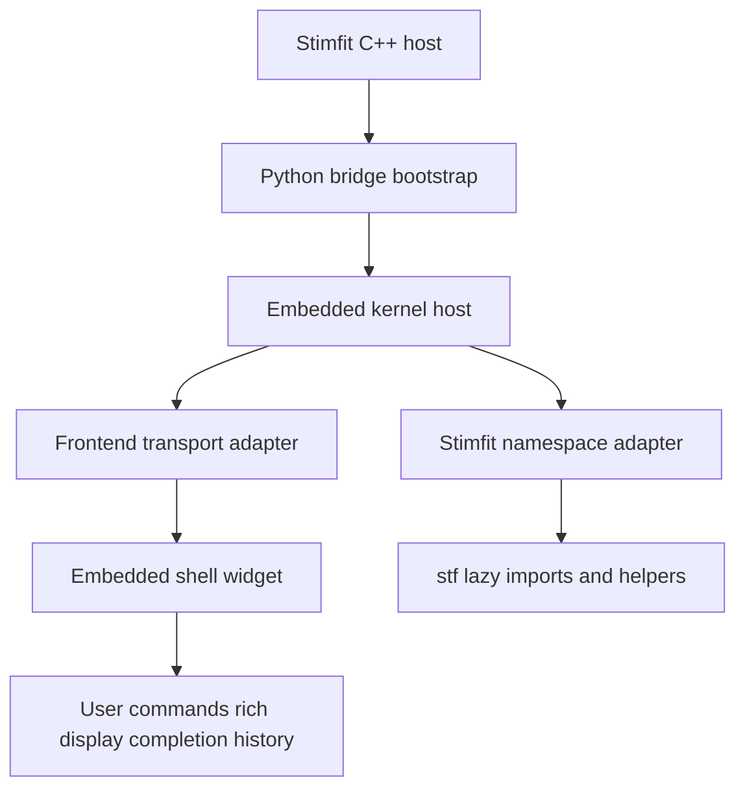

# IPython embedded shell architecture plan

## Objective

Replace the obsolete legacy IPython path with a new architecture that delivers a real modern IPython experience inside Stimfit by running a Jupyter-compatible kernel in process and attaching an embedded frontend widget inside the existing Stimfit shell pane.

## Architectural recommendation

Adopt a two-layer shell architecture:

1. a Stimfit-managed in-process kernel host that exposes a Jupyter messaging surface while sharing the existing embedded Python runtime
2. an embedded frontend widget hosted in the current shell window area that talks to that kernel through a local transport layer instead of the removed legacy [`IPython.ipapi.get()`](../src/stimfit/gui/unopt.cpp:372) model

This should be treated as a full replacement for the old [`#ifdef IPYTHON`](../src/stimfit/gui/parentframe.cpp:346) branch, not as a revival of [`embedded_ipython.py`](../src/stimfit/gui/parentframe.cpp:347).

## Why this architecture fits Stimfit

- It matches your stated goal of a real IPython experience rather than just keeping the current [`wx.py.shell.Shell`](../src/stimfit/py/embedded_shell_modern.py:15) UI.
- It removes dependence on missing legacy artifacts such as [`embedded_ipython.py`](../src/stimfit/py/CMakeLists.txt) and obsolete execution hooks like [`ip.ex`](../src/stimfit/gui/unopt.cpp:380).
- It preserves the current Stimfit-owned embedding point in [`makeWindow`](../src/stimfit/gui/parentframe.cpp:352), so the GUI integration can stay conceptually similar even though the shell implementation changes.
- It allows import, completion, history, rich traceback, and inspection behavior to come from a modern kernel and frontend protocol instead of Stimfit-specific shell internals.

## Proposed target architecture

## Component design

### 1. C++ shell host layer

Keep the existing shell pane creation entrypoint in [`parentframe.cpp`](../src/stimfit/gui/parentframe.cpp:381), but simplify it so C++ only does three things:

- prepare Python import paths and environment
- import one canonical shell module
- ask that module to create the shell widget

The new design should eliminate legacy compile-time branching on [`IPYTHON`](../cmake/StimfitToolchain.cmake:15) and reduce backend choice to a runtime module contract.

### 2. Python bootstrap module

Introduce a new Python-side bootstrap module, likely something like [`embedded_shell_ipython.py`](../src/stimfit/py/CMakeLists.txt), responsible for:

- starting the in-process kernel host only once per application lifetime
- creating the frontend widget for the parent wx container
- exposing a stable [`MyPanel`](../src/stimfit/gui/parentframe.cpp:356)-compatible API so C++ integration remains narrow
- registering Stimfit startup imports now handled through [`from embedded_init import *`](../src/stimfit/py/embedded_shell_modern.py:125)

This module should be the only Stimfit-specific entrypoint for the new shell stack.

### 3. In-process kernel host

Build a dedicated kernel host abstraction around an IPython or Jupyter kernel implementation, with these responsibilities:

- own kernel lifecycle start stop restart
- provide a namespace seeded with Stimfit helpers from [`embedded_init.py`](../src/stimfit/py/embedded_init.py:16)
- serialize execution requests coming from the embedded frontend
- surface stdout stderr display data completion and introspection replies back to the frontend
- provide a controlled API for Stimfit menu actions such as import module reload module and context injection

The kernel host should not depend on removed singletons such as [`IPython.ipapi.get()`](../src/stimfit/gui/unopt.cpp:372). Instead, Stimfit should talk to the host through explicit Python functions or objects retained by the bootstrap module.

### 4. Embedded frontend widget

Use a dedicated embedded frontend widget instead of trying to stretch [`wx.py.shell.Shell`](../src/stimfit/py/embedded_shell_modern.py:15) into an IPython UI.

The frontend responsibilities are:

- render prompts input output and rich tracebacks
- issue Jupyter execute completion history and inspection requests
- manage keybindings multi-line editing and history
- host any rich output area that can later be extended for figures or mime bundle rendering

The key architectural decision is to isolate the frontend behind a transport adapter so the rest of Stimfit does not care whether the UI implementation is a wx-native text control wrapper, an embedded web view, or another widget technology.

### 5. Transport adapter

Because the kernel is in process, avoid legacy direct object poking and also avoid unnecessary external process assumptions.

Use an internal transport abstraction with one implementation for the initial rollout:

- in-process message queues or loopback channels that mimic Jupyter request reply and publish flows

This gives two benefits:

- the frontend and kernel can still be reasoned about as separate protocol actors
- an external console or remote debugging frontend could be added later without rewriting the shell business logic

### 6. Stimfit namespace adapter

Add a dedicated namespace service responsible for exposing Stimfit objects and helpers into the kernel namespace. This replaces the old behavior where imports were injected differently depending on [`#ifdef IPYTHON`](../src/stimfit/gui/unopt.cpp:369).

The adapter should:

- load [`embedded_init.py`](../src/stimfit/py/embedded_init.py:16) consistently for all shell modes
- expose lazy [`stf`](../src/stimfit/py/embedded_init.py:67) access without forcing early SWIG import
- provide helper methods for adding current document selection recording and analysis state to the shell namespace
- own the import or reload workflow currently built as ad hoc source strings in [`ImportPython`](../src/stimfit/gui/unopt.cpp:359)

### 7. Import execution service

Remove shell-specific import semantics from C++.

Instead of building source strings that call [`ip.ex`](../src/stimfit/gui/unopt.cpp:380) or raw [`PyRun_SimpleString`](../src/stimfit/gui/unopt.cpp:401), route user-driven imports through a Python API such as:

- `stimfit_shell.import_module_from_path path`
- `stimfit_shell.reload_module name`
- `stimfit_shell.push_context data`

That gives one implementation regardless of shell frontend.

## Integration seams

### GUI seam

The existing call to [`MakePythonWindow`](../src/stimfit/gui/parentframe.cpp:381) remains the embedding seam. The only required C++ contract should be:

- shell module import name
- widget factory name
- optional lifecycle callbacks for restart or shutdown

### Python initialization seam

The current environment setup in [`parentframe.cpp`](../src/stimfit/gui/parentframe.cpp:335) should be retained in spirit but simplified to import one shell bootstrap module. All IPython-specific startup logic should move out of C++ strings and into Python modules.

### Menu action seam

The menu-driven import path in [`ImportPython`](../src/stimfit/gui/unopt.cpp:359) should call a single Python facade rather than embed different execution code paths for legacy IPython and non-IPython shells.

### Build and packaging seam

The Python install list in [`src/stimfit/py/CMakeLists.txt`](../src/stimfit/py/CMakeLists.txt:60) should eventually ship the new shell bootstrap and any helper modules. Packaging should stop referencing missing files such as [`embedded_ipython.py`](../dist/windows/nsis/installer.nsi.in:234).

## Migration strategy

### Phase 1: remove dead legacy assumptions

Remove or deprecate immediately:

- [`STF_ENABLE_IPYTHON`](../cmake/StimfitOptions.cmake:8) because it encodes a dead implementation path rather than a meaningful product choice
- compile definition wiring in [`StimfitToolchain.cmake`](../cmake/StimfitToolchain.cmake:15)
- dead legacy branches in [`parentframe.cpp`](../src/stimfit/gui/parentframe.cpp:346) and [`unopt.cpp`](../src/stimfit/gui/unopt.cpp:369)
- stale packaging entry for [`embedded_ipython.py`](../dist/windows/nsis/installer.nsi.in:234)
- stale summary output for [`STF_ENABLE_IPYTHON`](../cmake/StimfitMigration.cmake:9)
- stale comments in [`embedded_init.py`](../src/stimfit/py/embedded_init.py:11)

Retain temporarily only if needed during implementation:

- [`STF_PY_SHELL_BACKEND`](../cmake/StimfitOptions.cmake:9) as the feature flag for switching between the current shell and the new architecture during migration
- [`embedded_stf.py`](../src/stimfit/py/embedded_stf.py:1) and [`embedded_shell_modern.py`](../src/stimfit/py/embedded_shell_modern.py:1) as fallback paths until the new shell is stable

### Phase 2: add the new IPython shell stack behind a migration backend

Add a new backend value to [`STF_PY_SHELL_BACKEND`](../cmake/StimfitOptions.cmake:9), such as `JUPYTER`, and route [`parentframe.cpp`](../src/stimfit/gui/parentframe.cpp:281) to one bootstrap module per backend. This gives a reversible migration path without preserving the obsolete [`IPYTHON`](../cmake/StimfitToolchain.cmake:15) macro.

### Phase 3: unify import and namespace management

Move the import logic out of [`wxStfApp::ImportPython`](../src/stimfit/gui/unopt.cpp:359) and into Python services shared by all backends. Once complete, C++ should stop constructing import source code entirely.

### Phase 4: make the new backend the default

After the new shell handles execution completion history restart and module import reliably, switch the default backend away from `MODERN` to the new kernel-backed mode, while keeping a non-IPython fallback for environments where the richer stack cannot start.

### Phase 5: retire old shell implementations if desired

Once validated across supported platforms, decide whether [`embedded_stf.py`](../src/stimfit/py/embedded_stf.py:1) remains as a low-dependency fallback or whether [`embedded_shell_modern.py`](../src/stimfit/py/embedded_shell_modern.py:1) can absorb that responsibility alone.

## Recommended concrete work breakdown

1. Remove obsolete legacy IPython build and packaging hooks.
2. Introduce a new backend name in [`STF_PY_SHELL_BACKEND`](../cmake/StimfitOptions.cmake:9) for the kernel-backed shell.
3. Create a Python bootstrap module for the new backend with a stable panel factory contract.
4. Implement a kernel host abstraction with lifecycle and namespace management.
5. Implement a frontend transport adapter and embedded widget.
6. Rework [`ImportPython`](../src/stimfit/gui/unopt.cpp:359) to call a Python facade instead of generating shell-specific source code.
7. Update packaging in [`src/stimfit/py/CMakeLists.txt`](../src/stimfit/py/CMakeLists.txt:60) and [`installer.nsi.in`](../dist/windows/nsis/installer.nsi.in:220).
8. Keep [`embedded_shell_modern.py`](../src/stimfit/py/embedded_shell_modern.py:1) as a migration fallback until the new backend is proven.

## Design constraints and risks

### Dependency and portability risk

A modern Jupyter stack introduces more moving parts than the current shell. The implementation must define which dependencies are mandatory and how they are packaged on macOS Windows and Linux.

### GUI technology risk

A true rich frontend may push Stimfit beyond the capabilities of a simple wx text widget. The plan should therefore keep the frontend behind an adapter boundary so the initial widget can be simple while leaving room for a richer renderer later.

### Kernel reentrancy risk

Because the kernel runs in process with the application, long-running user code can block the UI unless execution and message pumping are coordinated carefully.

### Stimfit object lifetime risk

Objects exposed to the shell may outlive their underlying C++ resources. The namespace adapter must normalize how current recording and document objects are published and invalidated.

### Fallback behavior risk

The product should keep a minimal shell path available while the new architecture matures, likely through [`embedded_shell_modern.py`](../src/stimfit/py/embedded_shell_modern.py:1).

## Acceptance criteria for the future implementation

The new architecture should not be considered complete until all of the following are true:

- Stimfit no longer references [`embedded_ipython.py`](../dist/windows/nsis/installer.nsi.in:234) or [`IPython.ipapi`](../src/stimfit/gui/unopt.cpp:371)
- shell creation in [`parentframe.cpp`](../src/stimfit/gui/parentframe.cpp:281) selects backends without the obsolete [`IPYTHON`](../cmake/StimfitToolchain.cmake:15) macro
- module import and reload from the GUI work through one backend-agnostic service instead of separate legacy and non-legacy paths
- the embedded shell widget supports command execution completion inspection history and rich traceback behavior
- Stimfit startup remains resilient when optional rich shell dependencies are absent, with fallback to [`embedded_shell_modern.py`](../src/stimfit/py/embedded_shell_modern.py:1)

## Review summary

Recommended direction: build a new kernel-backed embedded shell architecture and remove the dead legacy IPython path immediately, while keeping the current modern shell as a migration fallback.
